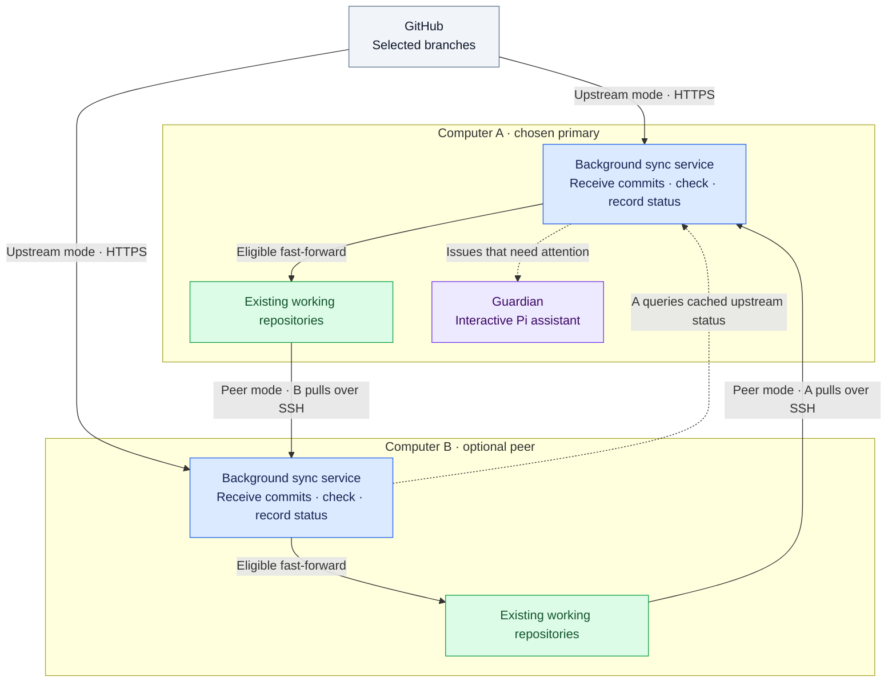
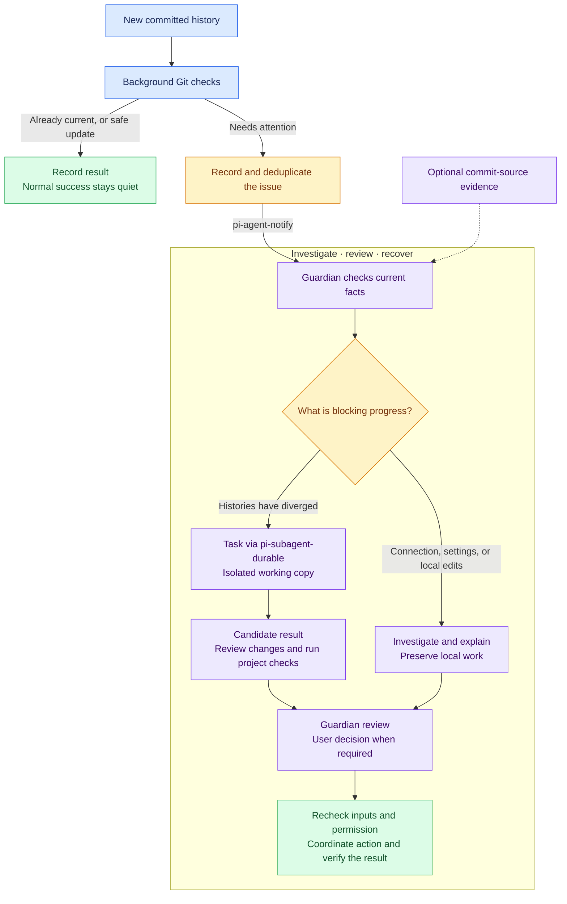

# git-sync

**Background Git updates, with AI assistance when you need it.**

**English** · [简体中文](README.zh-CN.md)

[](LICENSE)
[](#requirements)

Keep existing Git projects up to date **between two computers**, or **from GitHub to one computer**. Straightforward updates can run automatically. When progress is blocked, an optional **Guardian**—a [Pi](https://github.com/earendil-works/pi)-powered assistant you can talk to—helps you understand the problem and work through the next step.

> git-sync moves **commits**: versions you have already saved in Git. It is not live folder mirroring, a backup system, or a way to copy unfinished edits between computers.

[Choose a mode](#choose-a-mode) · [Architecture](#how-it-fits-together) · [Get started](#get-started) · [Guardian](#when-sync-needs-help) · [Safety](#what-happens-to-my-local-work) · [Documentation](#documentation)

## Why use it?

- **Switch computers without repeating the same Git checks.** Each configured computer can receive the other's committed work and apply eligible updates.
- **Pick up work committed on GitHub.** Changes from a teammate, ChatGPT, or another coding tool are normal input; the project does not need to exist on a second computer.
- **Keep human judgment available.** Open the Guardian session to see what it found, discuss a conflict, or decide how to preserve local changes.
- **Keep normal work quiet.** Successful background sync does not need an AI model. The Guardian is notified about problems that need attention, not every successful commit.

You choose which projects and branches to manage, and when updates may be applied. Configuration and sync records stay on your own computers.

## Choose a mode

| Your situation | Mode | What happens |
| --- | --- | --- |
| The same project already exists on two computers | **Peer sync** | Each computer pulls the selected branch from the other over verified SSH. |
| A project exists on one computer and receives updates on GitHub | **GitHub upstream sync** | That computer pulls its selected GitHub branch over HTTPS. No second checkout is needed. |
| You want one place to investigate problems across both computers | **Central Guardian** | Choose a primary computer for the Pi session. It can monitor the peer's upstream projects without keeping local copies. |

**Choose one sync source per repository:** peer or GitHub upstream. Different repositories can use different modes. Each installation supports at most one peer; this is not a multi-host replication cluster.

Syncing from a peer or GitHub does **not** automatically push your local commits to GitHub.

## How it fits together

The workflow separates three jobs: **receive committed history**, **check whether an update is safe**, and **ask an assistant for help when needed**.



**Read this as a map of supported arrangements, not simultaneous routes for one repository.** Solid arrows carry committed history or apply an eligible update; dashed arrows carry status and notifications. An upstream-only project needs a checkout only on its owner computer. A monitor-only primary needs no business checkout at all.

The primary is the computer you choose to host the Guardian—not a required device model or a central Git server. Both computers make their own local update decisions under their configured permissions.

### What counts as an automatic update?

1. **Discover and select.** Find existing repositories in the directories you choose. Finding a repository does not automatically enable it.
2. **Receive first.** Fetch a specific commit into a separate local history store, without immediately changing your working files.
3. **Check before applying.** Verify the branch, local changes, repository identity, and relationship between the commits.
4. **Update or pause.** If explicitly allowed and all checks pass, perform a **fast-forward**: move to a newer commit that already contains your local history, without creating a merge commit or rewriting history. Otherwise, preserve the work and report the state.

**“Received” is not the same as “applied.”** A commit may be downloaded while your checkout remains unchanged—for example, because it is already current or because an update is blocked.

## When sync needs help

When an update stops, you should not have to piece together logs from two computers to understand why. **Guardian helps you investigate the problem and choose what to do next.**

- **Understand the blocker.** Check the project state and explain whether the issue is a connection problem, local edits, or conflicting commits.
- **Work through conflicts.** Delegate a merge attempt to a separate task that prepares and checks a result in an isolated working copy, away from your ongoing work.
- **Stay in control.** Review the findings, give instructions, and make any required decisions before changes are applied.

You can return to the same conversation in Pi at any time, or use [pi-session-viewer](https://github.com/roshameow/pi-session-viewer) to access it through a desktop window.



[Connect a Guardian](docs/guardian.md) to enable this assistance. Routine updates work without it, but issues will need your attention until an assistant is connected. Guardian follows the permissions you give it and asks for a decision when the next action falls outside them.

- Divergence and recovery-required states are raised promptly; repeated failures and selected persistent blockers are reported after repeated completed passes.
- The optional bundled provenance bridge records Pi session observations. The Guardian can use reliable evidence to contact an original development session when appropriate. **An observed commit is not proof of authorship**; unknown or manual sources remain valid sync input.
- The built-in isolated merge preview is currently **peer-mode only**. A preview is neither project-test success nor permission to apply it.

[Connect the Guardian →](docs/guardian.md) · [Guardian instruction template →](docs/guardian-agent.md) · [How provenance works →](docs/provenance.md)

## What happens to my local work?

| Situation | Background behavior |
| --- | --- |
| The selected branch is already current | Leave the checkout as it is. |
| A fast-forward is possible and tracked files / staging area are unchanged | Apply it **only if automatic updates were enabled**. |
| Unrelated untracked or ignored files exist | Leave them in place; they do not automatically block the update. |
| A target path would overwrite or collide with local content | Block the update and preserve that content. |
| Tracked files or the staging area contain changes | Block automatic application; do not silently move or stash the work. |
| Both histories have new, different commits | Stop the fast-forward path and involve the Guardian / resolver workflow. |
| Local committed history is ahead | Do not roll it back or auto-push it. In peer mode, check the other computer's progress when needed. |
| An operation was interrupted or its outcome is uncertain | Retain recovery evidence for inspection, rather than deleting locks or guessing. |

The **background service** does not automatically clone working repositories, push, stash, reset, clean, switch branches, or create semantic merges. It does not run repository hooks or project tests during fast-forward. Guardian-directed work is separate and follows your instructions.

These checks are safeguards, **not a backup or an operating-system sandbox**. They cannot freeze an editor or another Git process, and an I/O failure can leave a partial update. Start with a disposable repository and read the [recovery guidance](docs/safety.md) before enabling real updates.

## Get started

### Requirements

**Install only what your chosen workflow needs.** Basic synchronization does not require Pi or a model account. To use the Guardian, install and configure the additional projects listed below.

| Component | Required when | What you need to configure |
| --- | --- | --- |
| Git at `/usr/bin/git` and a POSIX environment | All modes | Existing local repositories and the branches you want to manage. Native Windows is not supported. |
| Node.js | All modes | Node **20.10+** for the CLI; use **22.19+** for the complete Pi workflow. |
| [GitHub CLI (`gh`)](https://github.com/cli/cli) | Authenticated GitHub upstream access | Your saved `gh` login and its absolute executable path in `workflow.json`. Private repositories require access to that account's selected repository. |
| SSH at `/usr/bin/ssh` | Peer sync or cross-computer monitoring | Noninteractive key login, a verified Ed25519 host key, peer address/account, and the peer's Node/CLI paths. |
| Python **3.9+** | Guardian notifications | Its absolute executable path in `workflow.json`. |

### Projects used by the Guardian

| Project | Required or optional? | Purpose and setup |
| --- | --- | --- |
| [Pi](https://github.com/earendil-works/pi) | Required for Guardian | Runs the assistant conversation. Install Pi, select a supported model/provider, and configure access as needed; model access and credentials are not included with git-sync. |
| [pi-agent-notify](https://github.com/roshameow/pi-agent-notify) | Required for automatic Guardian notifications | Delivers issues to the selected Pi session. Load the package in Pi and configure git-sync with the installed `scripts/notify_agent.py` path. |
| [pi-subagent-durable](https://github.com/roshameow/pi-subagent-durable) | Required by the documented Guardian registration flow | Supplies Pi runtime registration and the task delegation used for isolated resolver work. Load it in the Guardian's Pi installation. |
| [RMUX](https://github.com/helvesec/rmux) | Required by the current interactive Guardian registration flow | Provides the existing terminal/pane target passed to `guardian register --rmux-target`. Start the Guardian in a real RMUX pane; the standalone durable package's subprocess fallback does not supply this target. |
| [pi-session-viewer](https://github.com/roshameow/pi-session-viewer) | Optional | A desktop interface for browsing and opening the session. You can use the Guardian's terminal without it. |
| Bundled [provenance bridge](docs/provenance.md), `extensions/provenance.ts` | Optional | Records observations from developer Pi sessions for source investigation. Enable it in those sessions if you want that evidence; it is not needed for basic sync. |

Use the [Guardian setup guide](docs/guardian.md#install-the-public-pi-integrations) for installation and session registration. GitHub commits created by ChatGPT or another tool do **not** require that tool to be installed: they are ordinary Git input. AI assistance uses the model/provider you configure in Pi, with that provider's normal usage costs.

### Configuration you provide

The defaults below are **local configuration/state paths, outside this source checkout**. XDG settings or `GIT_SYNC_HOME` can change them; see [path setup](docs/setup.md#1-build-and-choose-external-paths).

| File or setting | What it controls | How to set it up |
| --- | --- | --- |
| `~/.config/git-sync/config.json` | Directories to discover and directory exclusions | Created by `init`; add roots with `discover --root`. |
| `~/.config/git-sync/workflow.json` | Guardian primary host, optional peer connection, and local `gh` / Python executables | Fill a [single-host](examples/workflow.single-host.example.json) or [peer](examples/workflow.example.json) example with your own values. |
| `~/.local/state/git-sync/direct-sync.json` | Peer-mode repositories, local/peer paths, branch, polling interval, and permission to fast-forward | Fill the [direct-sync example](examples/direct-sync.example.json) on each participating computer. Start with apply disabled if you only want to verify receipt. |
| `~/.local/state/git-sync/upstream-sync.json` | GitHub-mode repositories, branches, interval, and apply permission | Created or updated by `sync upstream enable`; that command opts into eligible automatic updates. |
| Guardian session and sender | Which running Pi session receives notifications | Start Pi, then use `guardian register` and `guardian configure` as described in the [guide](docs/guardian.md#start-and-register-the-existing-interactive-session). |

Match host IDs across your configuration. In `workflow.json`, `peers.*.nodeExecutable` and `peers.*.cliEntrypoint` are paths **on the other computer**; `executables.githubCli` and `executables.python` are paths **on this computer**. Check your actual executable locations rather than assuming defaults. Keep configuration owner-private (`0600`) and never put credentials into the examples.

Peer SSH does not inherit your SSH aliases, proxy settings, or `SSH_AUTH_SOCK`; follow the [peer connection requirements](docs/setup.md#3b-optional-two-host-direct-receipt). The included service installer uses **macOS LaunchAgent**. On Linux, run the foreground service or use your own supervisor. This is a terminal-based developer tool, not a one-click desktop sync app.

### 1. Build the public source

For a new checkout:

```sh
git clone https://github.com/roshameow/git-sync.git
cd git-sync
npm ci
npm run build
node dist/src/cli.js --help
```

### 2. Discover first, without enabling updates

For a **new installation**, replace the directory below with an existing directory containing your Git projects:

```sh
SOURCE="$PWD"
NODE="$(node -p 'process.execPath')"
CLI="$SOURCE/dist/src/cli.js"

"$NODE" "$CLI" init --host-id workstation --root /REPLACE_WITH_YOUR_PROJECT_DIRECTORY
"$NODE" "$CLI" discover
"$NODE" "$CLI" registry status
```

These commands initialize local metadata and list projects. **They do not enable synchronization.** Here, “registry” means your local list of selected repositories, not another GitHub repository.

Already initialized? Do not start over. Add a directory with `discover --root /YOUR_ADDITIONAL_DIRECTORY`. Keep live configuration, credentials, and state outside the source checkout.

### 3. Choose the setup you need

First set the external configuration/state paths in [setup §1](docs/setup.md#1-build-and-choose-external-paths); its commands define `CONFIG_DIR` and `STATE_DIR`. If you ran `init` above, **do not repeat initialization** in the guide—continue with your chosen mode.

| Next step | Guide |
| --- | --- |
| Receive GitHub updates on one computer | [Single-host setup](docs/setup.md#3a-start-with-one-host-and-github-no-peer) |
| Synchronize an existing project on two computers | [Peer setup](docs/setup.md#3b-optional-two-host-direct-receipt) |
| Keep sync running and connect a Pi session | [Daemon and Guardian setup](docs/guardian.md) |

The guides cover executable paths, authentication, repository selection, and permissions. Fill the example configuration with **your own values**. `sync upstream enable` explicitly authorizes eligible automatic updates; discovery alone does not.

### 4. Check progress

After setup, use the same `NODE` and `CLI` values:

```sh
"$NODE" "$CLI" sync status     # Read recorded transfer / apply results
"$NODE" "$CLI" sync wake       # Request a pass under the existing permissions
"$NODE" "$CLI" daemon status   # Check the background service
```

Check the **apply result**, not only whether a commit was received. `up-to-date` means no update was needed; `fast-forwarded` means one was applied. `blocked-dirty` means local changes or a path collision need inspection—not necessarily a merge conflict. A wake request is not proof that sync has finished.

## Documentation

| Topic | Guide |
| --- | --- |
| Configuration, discovery, and selecting repositories | [Setup](docs/setup.md) |
| Service installation, normal Pi session registration, and notifications | [Daemon & Guardian](docs/guardian.md) |
| Reusable instructions for your Guardian session | [AGENTS.md template](docs/guardian-agent.md) |
| Safety gates, status meanings, and interrupted operations | [Safety & recovery](docs/safety.md) |
| Optional Pi observations and explicit commit attribution | [Provenance](docs/provenance.md) |
| Moving from the older core-only release | [Migration](docs/migration.md) |
| Keeping personal docs/config out of an open-source release | [GitHub publication skill](skills/github-public-release/SKILL.md) |

The v0.1 core configuration is **not automatically compatible** with this workflow. Preserve its state and recovery evidence before migrating. Supported layout and transport restrictions—including unsupported checkout filters, submodules, shallow/sparse layouts, and SHA-256 repositories—are explained in the setup and safety guides.

## Contributing and reporting issues

Bug reports, documentation improvements, and focused changes are welcome. For a bug, include your OS, Node version, selected sync mode, reproduction steps, and **sanitized** transfer/apply states. Do not post credentials, private keys, session transcripts, or your full machine configuration.

Before submitting a code change:

```sh
npm run typecheck
npm test
```

Tests cover real temporary Git repositories, preservation of local work, configuration changes, interruption handling, and notification routing. Passing them does not establish that a particular user's SSH, GitHub, or Pi setup is ready.

## License

[MIT](LICENSE).
