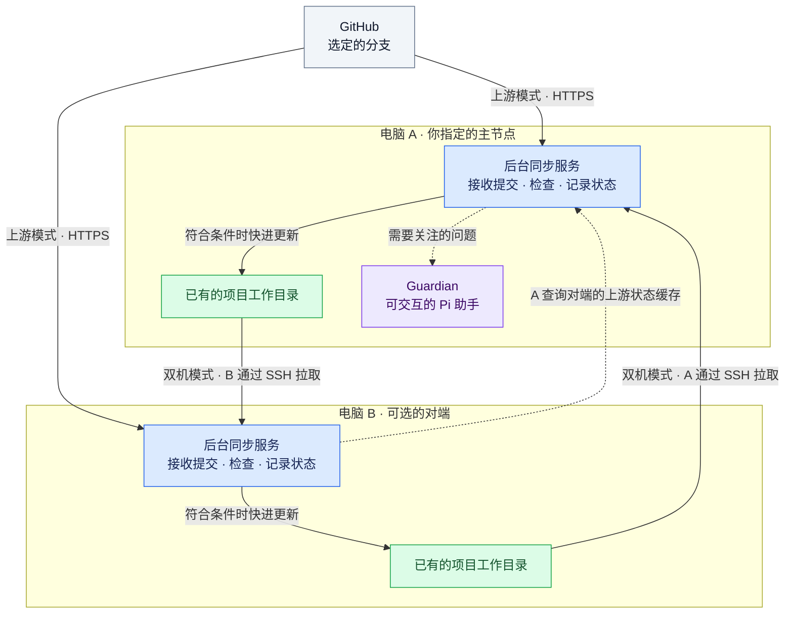
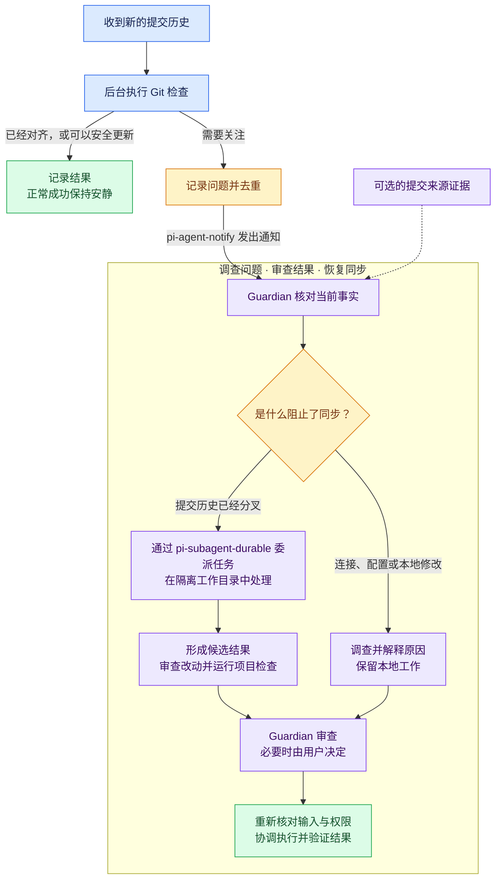

# git-sync

**日常 Git 更新交给后台，需要时由 AI 协助处理。**

[English](README.md) · **简体中文**

[](LICENSE)
[](#运行要求)

让已有的 Git 项目在**两台电脑之间同步**，或让**一台电脑自动接收 GitHub 更新**。能够直接、安全推进的更新由后台完成；遇到阻塞时，可选的 **Guardian** 会调查问题、组织下一步操作。它基于 [Pi](https://github.com/earendil-works/pi)，你可以随时与它对话、查看结果并给出指示。

> git-sync 同步的是 **commit（提交）**，也就是你已经通过 Git 保存的版本。它不是实时文件夹镜像、备份系统，也不会把尚未提交的修改复制到另一台电脑。

[选择模式](#选择适合你的模式) · [架构图](#它是怎样工作的) · [开始使用](#开始使用) · [Guardian](#同步遇到问题时谁来处理) · [本地修改](#我的本地修改会怎样) · [文档导航](#文档导航)

## 它能帮你解决什么问题？

- **在不同电脑之间切换工作。** 配置后的电脑可以接收对方已经提交的代码，并应用符合条件的更新，减少重复执行同一套 Git 检查。
- **接收 GitHub 上产生的新提交。** 无论提交来自队友、ChatGPT 还是其他编码工具，都可以正常处理；不要求另一台电脑也有这个项目。
- **遇到复杂情况，有一个能对话的助手。** 打开 Guardian 会话，就能查看调查结果、讨论冲突，或决定怎样保留本地改动。
- **正常同步保持安静。** 成功的后台同步不需要调用模型。需要关注的问题才通知 Guardian，不会每来一个提交就让 AI 工作一次。

由你选择管理哪些项目和分支，以及什么时候允许应用更新。配置和同步记录保存在你自己的电脑上。

## 选择适合你的模式

| 你的情况 | 使用方式 | 它会做什么 |
| --- | --- | --- |
| 两台电脑已经有同一个项目 | **双机同步** | 双方各自通过已验证的 SSH 连接，拉取对方指定分支的提交。 |
| 项目只有一台电脑有，更新来自 GitHub | **GitHub 上游同步** | 这台电脑通过 HTTPS 拉取指定 GitHub 分支，不需要第二份本地仓库。 |
| 想在一个会话里集中处理两台电脑的问题 | **集中式 Guardian** | 选择一台主机运行 Pi 会话；它可以监控对端的上游同步，不必在自己这台机器上保存项目副本。 |

**同一个仓库选择一种同步来源：对端或 GitHub。** 不同仓库可以采用不同模式。每个安装实例最多配置一个对端；这不是多主机复制集群。

从对端或 GitHub 拉取更新，**不意味着它会自动把你的本地提交 push 到 GitHub**。

## 它是怎样工作的？

整个工作流把三件事分开：**接收提交、判断能否安全更新、在需要时找助手处理问题。**



**这张图展示可选的部署组合，不是要求同一个仓库同时走两条路径。** 实线表示接收提交或应用符合条件的更新，虚线表示状态与通知。只使用 GitHub 上游模式的项目，仅需在所属电脑上存在；只负责监控的主节点可以没有任何业务仓库。

“主节点”只是你选择运行 Guardian 的电脑，不是指定型号，也不是中央 Git 服务器。两台电脑都按照各自配置的权限，决定是否更新自己的工作目录。

### 一次自动更新会经过哪些步骤？

1. **先发现，再选择。** 在你指定的目录中识别已有仓库。发现了一个仓库，不等于自动接管它。
2. **先接收，不急着改文件。** 把一个确定的提交下载到独立的本地提交存储中，暂不更新工作目录。
3. **更新前做检查。** 核对分支、本地修改、仓库身份，以及新旧提交之间的关系。
4. **能够直接推进就更新，否则暂停。** 只有你明确启用了自动更新，且检查通过时，才执行**快进**：前进到一个已经包含本地历史的新提交，不额外创建合并提交，也不改写历史。否则保留现状并报告状态。

**“已接收”不等于“已应用”。** 新提交可能已经下载，但工作目录没有变化——可能因为已经是最新，也可能因为更新被阻止了。

## 同步遇到问题时，谁来处理？

更新停下来时，你不必自己拼凑两台电脑的日志来寻找原因。**Guardian 会帮助你调查问题，并确定下一步怎么处理。**

- **弄清阻塞原因。** 检查项目状态，解释问题来自连接、本地修改，还是双方提交之间的冲突。
- **协助解决冲突。** 将合并尝试交给独立任务，在隔离的工作目录中准备和检查结果，不直接动你正在进行的工作。
- **保留你的决定权。** 你可以查看调查结果、给出指示，并在应用改动前作出必要的决定。

你随时都能回到同一个 Pi 会话继续讨论，也可以通过 [pi-session-viewer](https://github.com/roshameow/pi-session-viewer) 在桌面窗口中打开它。



完成 [Guardian 配置](docs/guardian.md)后，即可使用这些协助功能。没有接入助手时，日常更新仍可运行，但遇到问题需要你自行处理。Guardian 按照你授予的权限行动，下一步超出这些权限时，会请你作出决定。

- 分叉、需要恢复等状态会及时通知；重复失败和部分持续阻塞，在重复的已完成轮次后通知，避免正常编辑导致频繁打扰。
- 可选的来源观察桥接已随项目提供。Guardian 可以根据可靠证据，按需联系产生相关改动的原开发会话。**观察到提交变化，并不等于证明作者身份**；来源未知或手工提交也照常参与同步。
- 内置的隔离合并预览目前**只支持双机模式**。得到预览，不等于项目测试通过，更不等于已经获准应用。

[接入 Guardian →](docs/guardian.md) · [Guardian 职责模板 →](docs/guardian-agent.md) · [来源记录说明 →](docs/provenance.md)

## 我的本地修改会怎样？

| 当前情况 | 后台行为 |
| --- | --- |
| 指定分支已经是最新 | 保持工作目录现状。 |
| 可以快进，已跟踪文件和暂存区没有改动 | **仅在你启用了自动更新后**应用。 |
| 存在无关的未跟踪文件或忽略文件 | 留在原处，不会因此一概阻止更新。 |
| 新版本会覆盖本地内容，或发生路径冲突 | 阻止更新，保留这些内容。 |
| 已跟踪文件或暂存区有未提交修改 | 阻止自动应用，不会悄悄移动文件或 stash。 |
| 双方各自产生了不同的新提交 | 停止快进路径，交给 Guardian / resolver 流程。 |
| 本地提交历史领先 | 不回退，也不自动 push；双机模式下，必要时核对另一台电脑的接收与应用进度。 |
| 操作中断，或无法确定是否完整完成 | 保留恢复证据供检查，不通过删锁或猜测强行继续。 |

**后台服务**不会自动 clone 工作仓库、push、stash、reset、clean、切换分支或进行语义合并。快进过程不执行项目 hooks 或项目测试。Guardian 组织的操作是另一层工作，仍须遵循你的指令。

这些检查是保护措施，**不是备份，也不是操作系统沙箱**。它们无法冻结编辑器或其他 Git 进程；I/O 故障也可能造成部分更新。建议先用临时仓库试跑，正式启用前阅读[恢复说明](docs/safety.md)。

## 开始使用

### 运行要求

**按需要安装，不必一次装齐所有组件。** 基础同步不依赖 Pi 或模型账号；使用 Guardian 时，再安装并配置下面列出的配套项目。

| 组件 | 什么时候需要 | 需要配置什么 |
| --- | --- | --- |
| `/usr/bin/git` 与 POSIX 环境 | 所有模式 | 已有的本地仓库和要管理的分支；不支持原生 Windows。 |
| Node.js | 所有模式 | CLI 需要 **20.10+**；完整 Pi 工作流请使用 **22.19+**。 |
| [GitHub CLI（`gh`）](https://github.com/cli/cli) | 需要认证的 GitHub 上游访问 | 保存你自己的 `gh` 登录，并在 `workflow.json` 中指定其绝对路径。访问私有仓库时，账号必须具备对应仓库的权限。 |
| `/usr/bin/ssh` | 双机同步或跨机监控 | 无需交互的密钥登录、已核验的 Ed25519 主机密钥、对端地址与账号，以及对端 Node/CLI 路径。 |
| Python **3.9+** | Guardian 通知 | 在 `workflow.json` 中指定其绝对路径。 |

### Guardian 使用哪些项目？

| 项目 | 必需还是可选 | 用途与配置 |
| --- | --- | --- |
| [Pi](https://github.com/earendil-works/pi) | 使用 Guardian 时必需 | 运行助手会话。安装 Pi、选择受支持的模型 / 服务商，并按需要配置访问方式；git-sync 不附带模型访问权限或凭据。 |
| [pi-agent-notify](https://github.com/roshameow/pi-agent-notify) | 自动通知 Guardian 时必需 | 将问题投递到指定 Pi 会话。在 Pi 中加载这个包，并向 git-sync 配置已安装的 `scripts/notify_agent.py` 路径。 |
| [pi-subagent-durable](https://github.com/roshameow/pi-subagent-durable) | 当前文档所述的 Guardian 登记流程需要 | 提供 Pi 运行登记信息，以及隔离解决任务所用的委派能力。需在 Guardian 使用的 Pi 环境中加载。 |
| [RMUX](https://github.com/helvesec/rmux) | 当前交互式 Guardian 登记流程需要 | 提供 `guardian register --rmux-target` 所需的已有终端目标。应在真实的 RMUX 窗格中启动 Guardian；durable 单独提供的普通子进程模式不会生成这个目标。 |
| [pi-session-viewer](https://github.com/roshameow/pi-session-viewer) | 可选 | 用桌面界面浏览和打开会话。不安装它，也可以使用 Guardian 的终端会话。 |
| 随项目提供的[来源观察桥接](docs/provenance.md)：`extensions/provenance.ts` | 可选 | 从开发者的 Pi 会话记录观察信息，供调查提交来源时参考。需要这些证据时，在相应开发会话中启用；基础同步不依赖它。 |

安装和会话登记步骤见 [Guardian 配置指南](docs/guardian.md#install-the-public-pi-integrations)。接收 ChatGPT 或其他工具产生的 GitHub 提交，**不要求安装对应工具**；它们都是普通 Git 输入。AI 协助使用你在 Pi 中配置的模型和服务商，并按该服务商的规则产生使用费用。

### 需要准备哪些配置？

下面是默认的**本机配置 / 状态路径，均位于源码仓库之外**。XDG 设置或 `GIT_SYNC_HOME` 可以改变这些位置，详见[目录配置](docs/setup.md#1-build-and-choose-external-paths)。

| 文件或设置 | 控制什么 | 怎样配置 |
| --- | --- | --- |
| `~/.config/git-sync/config.json` | 要发现仓库的目录及排除项 | 由 `init` 创建，用 `discover --root` 增量添加目录。 |
| `~/.config/git-sync/workflow.json` | Guardian 主节点、可选的对端连接、本机 `gh` / Python 路径 | 根据[单机示例](examples/workflow.single-host.example.json)或[双机示例](examples/workflow.example.json)，填写自己的值。 |
| `~/.local/state/git-sync/direct-sync.json` | 双机模式的仓库、本机 / 对端路径、分支、轮询间隔、快进许可 | 在参与同步的每台电脑上填写[双机同步示例](examples/direct-sync.example.json)。如果只想先验证接收，可先关闭应用权限。 |
| `~/.local/state/git-sync/upstream-sync.json` | GitHub 模式的仓库、分支、间隔、应用权限 | 由 `sync upstream enable` 创建或更新；该命令会授权符合条件的自动更新。 |
| Guardian 会话与通知发送器 | 哪个正在运行的 Pi 会话接收问题通知 | 先启动 Pi，再按[指南](docs/guardian.md#start-and-register-the-existing-interactive-session)执行 `guardian register`、`guardian configure`。 |

各处的主机标识应保持一致。`workflow.json` 中的 `peers.*.nodeExecutable`、`peers.*.cliEntrypoint` 是**对端电脑**上的路径；`executables.githubCli`、`executables.python` 是**本机**路径。请核对实际安装位置，不要直接假定默认路径可用。配置文件应仅本人可读写（`0600`），不要把凭据写进示例。

对端 SSH 不继承你的 SSH 别名、代理设置或 `SSH_AUTH_SOCK`，请遵循[双机连接要求](docs/setup.md#3b-optional-two-host-direct-receipt)。内置服务安装器使用 **macOS LaunchAgent**；Linux 用户可运行前台服务，或使用自己的进程管理器。这是需要终端配置的开发者工具，不是一键安装的桌面同步软件。

### 1. 获取并构建公开源码

新建源码副本时运行：

```sh
git clone https://github.com/roshameow/git-sync.git
cd git-sync
npm ci
npm run build
node dist/src/cli.js --help
```

### 2. 先发现仓库，不立即启用更新

以下用于**全新安装**。请把目录占位符替换为你实际存放 Git 项目的已有目录：

```sh
SOURCE="$PWD"
NODE="$(node -p 'process.execPath')"
CLI="$SOURCE/dist/src/cli.js"

"$NODE" "$CLI" init --host-id workstation --root /REPLACE_WITH_YOUR_PROJECT_DIRECTORY
"$NODE" "$CLI" discover
"$NODE" "$CLI" registry status
```

这几条命令只初始化本地元数据并列出项目，**不会启用同步**。这里的 registry 指本机的仓库管理清单，不是另一个 GitHub 仓库。

已经初始化过？不用重来。使用 `discover --root /YOUR_ADDITIONAL_DIRECTORY` 增量添加目录。实际配置、凭据和运行状态应放在源码仓库之外。

### 3. 按你的场景完成配置

先按[配置指南第 1 节](docs/setup.md#1-build-and-choose-external-paths)设置仓库外的配置与状态目录，补齐 `CONFIG_DIR`、`STATE_DIR`。如果已经运行过上面的 `init`，**不要重复初始化**，直接进入对应模式的配置。

| 下一步想做什么 | 入口 |
| --- | --- |
| 一台电脑接收 GitHub 更新 | [单机上游配置](docs/setup.md#3a-start-with-one-host-and-github-no-peer) |
| 两台电脑同步已有项目 | [双机配置](docs/setup.md#3b-optional-two-host-direct-receipt) |
| 让服务持续运行，并接入 Pi 会话 | [后台服务与 Guardian](docs/guardian.md) |

详细指南会说明程序路径、认证、仓库选择和操作权限。示例配置必须填入**你自己的值**。`sync upstream enable` 会明确授权符合条件的自动更新；单纯发现仓库不会。目前详细部署指南为英文，两版 README 的能力与边界说明保持一致。

### 4. 查看进度

配置完成后，继续使用前面设置的 `NODE` 和 `CLI`：

```sh
"$NODE" "$CLI" sync status     # 读取已记录的接收 / 应用结果
"$NODE" "$CLI" sync wake       # 请求按现有权限执行一轮
"$NODE" "$CLI" daemon status   # 检查后台服务
```

请看**应用结果**，不要只看是否收到了提交：`up-to-date` 表示不需要更新，`fast-forwarded` 表示已经快进。`blocked-dirty` 表示需要检查本地修改或路径冲突，**不一定是合并冲突**。收到唤醒请求，不等于同步已经完成。

## 文档导航

| 想了解什么 | 文档 |
| --- | --- |
| 配置、发现仓库与选择同步模式 | [使用配置](docs/setup.md) |
| 服务安装、普通 Pi 会话登记与通知 | [后台服务与 Guardian](docs/guardian.md) |
| 可复用的 Guardian 会话职责说明 | [AGENTS.md 模板](docs/guardian-agent.md) |
| 安全检查、状态含义与中断恢复 | [安全与恢复](docs/safety.md) |
| 可选的 Pi 观察与显式提交来源记录 | [来源记录](docs/provenance.md) |
| 从旧版纯核心版本迁移 | [迁移指南](docs/migration.md) |
| 开源时保护私人文档与配置 | [GitHub 公开发布 skill](skills/github-public-release/SKILL.md) |

v0.1 纯核心版本的配置**不能直接套用**到当前工作流。迁移前请保留原状态和恢复证据。特殊 checkout 配置及传输限制——包括不支持的过滤器、子模块、浅克隆 / 稀疏布局、SHA-256 仓库——请查看配置与安全指南。

## 参与贡献与反馈问题

欢迎报告问题、改进文档，或提交范围明确的修改。反馈 bug 时，请提供系统、Node 版本、所用同步模式、复现步骤，以及**脱敏后的**接收 / 应用状态。不要上传凭据、私钥、会话全文或整份机器配置。

提交代码修改前运行：

```sh
npm run typecheck
npm test
```

测试覆盖临时真实 Git 仓库、本地改动保留、配置变化、中断处理和通知路由。测试通过，不等于某位用户自己的 SSH、GitHub 或 Pi 环境已经配置完成。

## 许可证

[MIT](LICENSE)。
